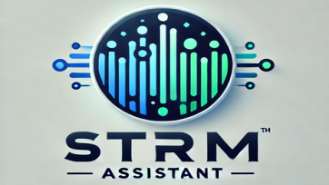

# STRM 助手

## [[English]](README.en.md)

## 用途

1. 提高首次播放的起播速度
2. 解决可能的无进度条问题
3. 视频截图预览缩略图增强
4. 片头片尾探测
5. 自动合并同目录视频为多版本
6. 独占模式提取媒体信息
7. 独立的外挂字幕扫描
8. 自定义`TMDB`备选语言
9. 刷新`TMDB`中文演员
10. 获取原语言海报
11. 中文搜索增强
12. 拼音首字母排序

## 更新

1. 支持并发提取媒体信息 (默认最小为 1, 最大为 10), 说明查看 [Wiki](https://github.com/sjtuross/StrmAssistant/wiki/媒体信息提取-(MediaInfo-Extract))
2. 添加 `仅支持Strm` 的选项，关闭后可以支持软链接或直连的场景
3. 包含附加内容处理
4. 按电影或剧集的发行日期倒序处理
5. 添加插件配置界面，可多选媒体库
6. 视频截图预览缩略图增强, 说明查看 [Wiki](https://github.com/sjtuross/StrmAssistant/wiki/视频截图预览增强)
7. 追更模式, 说明查看 [Wiki](https://github.com/sjtuross/StrmAssistant/wiki/追更模式-(Catch‐up-Mode))
8. 基于播放行为的剧集片头片尾探测, 说明查看 [Wiki](https://github.com/sjtuross/StrmAssistant/wiki/片头探测-(Intro-Detection))
9. 为原生跳片头探测解锁`Strm`支持
10. 自动合并同目录视频为多版本, 说明查看 [Wiki](https://github.com/sjtuross/StrmAssistant/wiki/自动合并同目录多版本)
11. 仅允许本插件提取媒体信息 (ffprobe) 以及视频截图 (ffmpeg), 说明查看 [Wiki](https://github.com/sjtuross/StrmAssistant/wiki/变相多线程入库)
12. 独立于扫库的外挂字幕扫描并更新，说明查看 [Wiki](https://github.com/sjtuross/StrmAssistant/wiki/外挂字幕扫描-(External-Subtitle-Scan))
13. 尽可能从`TMDB`获取中文或日文元数据, 说明查看 [Wiki](https://github.com/sjtuross/StrmAssistant/wiki/自定义-TMDB-备选语言)
14. 刷新`TMDB`中文演员并修复相关问题，说明查看 [Wiki](https://github.com/sjtuross/StrmAssistant/wiki/中文演员-(Chinese-Actor))
15. 优先使用原语言海报，支持`TMDB`, `TVDB`, `Fanart`，说明查看 [Wiki](https://github.com/sjtuross/StrmAssistant/wiki/原语言海报--(Original-Poster))
16. `TMDB`备选语言元数据以及中文演员繁转简
17. 支持中文模糊搜索和拼音搜索，说明查看 [Wiki](https://github.com/sjtuross/StrmAssistant/wiki/中文搜索增强)
18. 刷新元数据时自动生成拼音首字母为排序标题，说明查看 [Wiki](https://github.com/sjtuross/StrmAssistant/wiki/拼音首字母排序)
19. 添加支持从`NFO`导入演员头像链接

## 安装

1. 下载 `StrmAssistant.dll` 放入配置目录中的 `plugins` 目录
2. 重启Emby
3. 至插件页面检查版本及设置

**注意**: Emby最低版本要求 `4.8.0.80`

## 赞赏

如果这个项目对你有帮助，不妨请我喝杯咖啡。如果你欣赏这个项目，欢迎为它点亮一颗⭐️。感谢你对开源精神的认可与支持！

